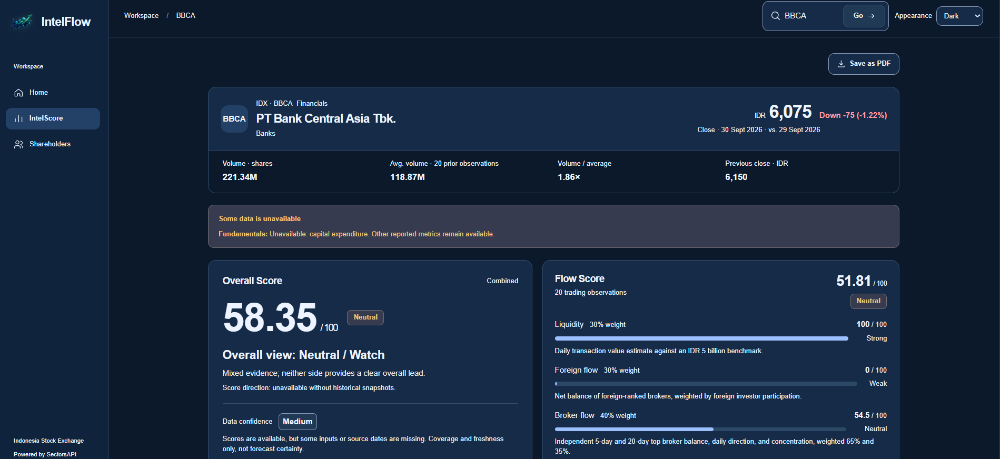
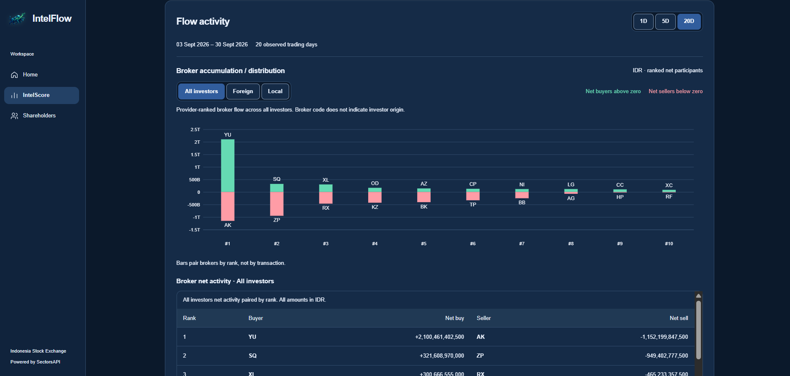
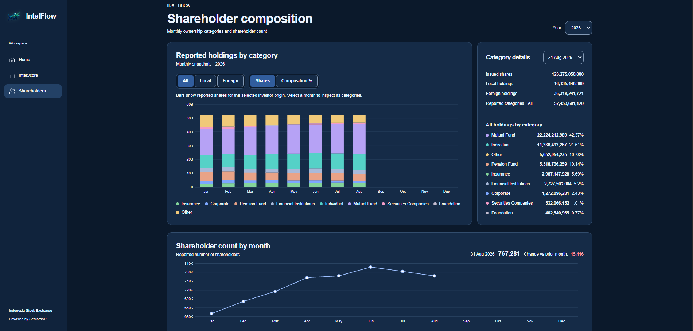
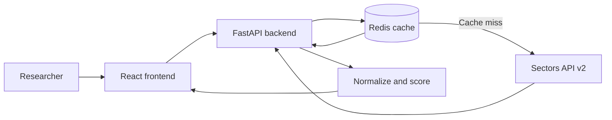

<p align="center">
  
</p>

<p align="center">
  <strong>Flow-first market intelligence for Indonesia Stock Exchange equities.</strong><br />
  Research broker activity, foreign participation, ownership, and business fundamentals for one ticker at a time.
</p>

<p align="center">
  <a href="#quick-start-with-docker">Quick start</a> ·
  <a href="#what-you-can-explore">Features</a> ·
  <a href="#app-preview">Preview</a> ·
  <a href="#how-the-scores-work">Scoring</a> ·
  <a href="#development-workflow-and-git-worktrees">Development</a> ·
  <a href="docs/PRD.md">Product brief</a>
</p>

## About IntelFlow

IntelFlow is a research workspace for Indonesian stocks. Enter an IDX ticker to see where capital is moving, which brokers are accumulating or distributing, how foreign investors are participating, and whether the company's fundamentals provide context for that activity.

These signals often live in separate tools. IntelFlow brings them into one dated, inspectable view. Its **Flow Score** and **Fundamental Score** are calculated independently, while an **Overall Score** summarizes both without hiding either one. Every score is paired with its components, evidence window, and data availability so the reader can make their own assessment.

IntelFlow is built for research and education. It does not place trades, predict prices, or issue buy/sell recommendations. Market data comes primarily from the [Sectors Financial API v2](https://docs.sectors.app/api-references).

## What you can explore

- **IntelScore:** Search a four-letter IDX symbol (an optional `.JK` suffix is accepted), then inspect the three scores, their drivers, and concise research insights.
- **Flow activity:** Compare 1-day, 5-day, and 20-day broker evidence, including leading buyers and sellers, foreign net flow, and liquidity context.
- **Investor-origin views:** Switch between All, Foreign, and Local views where supported. Broker identity and investor origin are distinct; a broker code does not identify the underlying investor.
- **Fundamentals:** Review growth, earnings quality, cash-flow quality, and valuation evidence next to the flow analysis.
- **Market context:** View a fixed three-month price candlestick chart alongside the selected company's dated close and volume context.
- **Shareholder composition:** Explore monthly category holdings, local versus foreign composition, and shareholder counts when the source reports them. This page has its own ticker search.
- **Evidence and export:** See source dates, coverage or missing-data states, switch between light/dark/system themes, and save the displayed IntelScore page as a visual PDF.

The interface reports partial or unavailable source data instead of filling gaps with invented values. A valid ticker can still have incomplete coverage from the provider.

## App preview

These screenshots show a BBCA research session in dark mode. The dates and figures reflect what was displayed when the images were captured; current data may differ. Select an image to open it at full size.

### IntelScore overview

Company context, data availability, and the separate Overall and Flow scores.

[](static/main-page.png)

### Flow activity

Broker accumulation and distribution over the selected 20-day window, with investor-origin controls and ranked net activity.

[](static/flow-activity-page.png)

### Shareholder composition

Monthly reported holdings by category, selected-month details, and shareholder counts.

[](static/shareholder-page.png)

## How the scores work

| Score                 | What it measures                                                   | Current composition                                                    |
| --------------------- | ------------------------------------------------------------------ | ---------------------------------------------------------------------- |
| **Flow Score**        | Liquidity and observed foreign/broker accumulation or distribution | 30% liquidity, 30% foreign flow, 40% broker flow                       |
| **Fundamental Score** | Business support for the observed flow                             | 30% growth, 25% earnings quality, 25% cash-flow quality, 20% valuation |
| **Overall Score**     | Combined research view                                             | 60% Flow Score, 40% Fundamental Score                                  |

Scores range from 0 to 100. A missing input is treated as unavailable, not as zero. The backend calculates results deterministically from dated Sectors inputs; the frontend displays them and does not recalculate them. The complete formula, normalization rules, version, and missing-data behavior are in [docs/SCORING.md](docs/SCORING.md).

## Technology and architecture

| Layer             | Stack                                                               | Role                                                                       |
| ----------------- | ------------------------------------------------------------------- | -------------------------------------------------------------------------- |
| Frontend          | React, TypeScript, Vite, Tailwind CSS, React Router, TanStack Query | Search, research pages, client-side navigation, and data loading           |
| Charts and export | Apache ECharts, html-to-image, pdf-lib                              | Interactive evidence charts and visual PDF export                          |
| Backend           | Python 3.12+, FastAPI, Pydantic, Uvicorn                            | HTTP API, source validation, normalization, research services, and scoring |
| Data              | Sectors Financial API v2, Redis                                     | Market/company inputs and cached provider responses                        |
| Delivery          | Docker Compose, uv, npm                                             | Local stack and dependency management                                      |
| Verification      | pytest, Vitest, Testing Library, Playwright                         | Backend, component, and browser checks                                     |



The API key stays on the backend. Redis reduces repeat upstream requests and API-credit usage. The frontend receives normalized data and score evidence through IntelFlow's own API; [docs/ARCHITECTURE.md](docs/ARCHITECTURE.md) describes the boundaries in detail.

## Quick start with Docker

**Prerequisites:** Docker Engine or Docker Desktop with Compose, a Sectors API key, and access to the Sectors API. Run the commands from the repository root.

1. Create a local environment file from the provided template if you do not already have one:

   ```sh
   cp .env.example .env
   ```

2. Set `SECTORS_API_KEY` in `.env`. Keep this file local; it is ignored by Git. The other values in the template can stay at their defaults for a first run.

3. Build and start the frontend, backend, and Redis:

   ```sh
   docker compose up -d --build
   docker compose ps
   ```

4. Open the [IntelFlow app](http://127.0.0.1:5173), or check the [backend health endpoint](http://127.0.0.1:8000/health) and [interactive API docs](http://127.0.0.1:8000/docs). Try a four-letter IDX ticker such as `BBCA`.

The Compose stack binds frontend port **5173**, backend port **8000**, and Redis port **6379** to `127.0.0.1`. On a cache miss, researching a ticker can make paid Sectors API requests. If port 6379 is already occupied, set `REDIS_PORT=6380` in `.env` before starting Compose; the backend container still uses the internal Redis address.

Useful commands:

```sh
docker compose logs -f backend    # Follow backend logs; Ctrl+C stops following
docker compose up -d --build      # Rebuild after source changes
docker compose down               # Stop services; keep the Redis cache volume
```

The frontend container serves a built bundle. Rebuild it after editing frontend source, or use the development workflow below for Vite reloads. `docker compose down -v` also deletes the Redis cache volume.

## Configuration

The complete set of defaults is in [`.env.example`](.env.example). The usual settings are:

| Variable          | Purpose                                                                            |
| ----------------- | ---------------------------------------------------------------------------------- |
| `SECTORS_API_KEY` | Required credential for Sectors requests; never commit it                          |
| `REDIS_PORT`      | Host port for the Compose Redis service (default `6379`)                           |
| `REDIS_URL`       | Redis address for a locally running backend; Compose sets its own internal address |
| `LOG_LEVEL`       | Backend logging level                                                              |
| `CORS_ORIGINS`    | Allowed browser origin(s) for direct backend requests                              |
| `CACHE_TTL_*`     | Cache lifetimes for different data categories                                      |

The backend needs both Redis and a nonempty Sectors API key at startup. If the stack fails to become healthy, check `docker compose ps` and `docker compose logs backend`. An upstream error, missing data, or exhausted API credits can also prevent a ticker's research result from loading even when `/health` succeeds.

## Verification

These checks use local fixtures and mocks by default, so they do not need paid Sectors calls:

```sh
npm ci
npm run build
npm run lint
npm test
uv run --group backend pytest
```

For browser tests on a new machine, install the browser once with `npx playwright install chromium`. Start `npm run dev` in another terminal, then run `npm run test:e2e`. The Playwright suite intercepts research API calls. Tests that contact real Redis or Sectors are opt-in through `TEST_REDIS_URL` and `RUN_SECTORS_TESTS=1`; the latter can consume API credits.

## Repository map

```text
.
├── compose.yaml              # Frontend, backend, and Redis
├── docs/                     # Product, scoring, API, schema, and design decisions
├── src/backend/              # FastAPI, Sectors integration, cache, services, scoring
├── src/frontend/             # React application, visualizations, tests
├── static/                   # README banner, source logo, and app screenshots
├── .env.example              # Safe configuration template
├── package.json              # Frontend scripts and dependencies
└── pyproject.toml            # Python dependencies and test configuration
```

Further reading: [product requirements](docs/PRD.md) · [scoring specification](docs/SCORING.md) · [local API contract](docs/API.md) · [data schema](docs/SCHEMA.md) · [frontend notes](docs/FRONTEND.md).

## Scope and license

IntelFlow currently focuses on research for a selected symbol. Historical score snapshots, a standalone broker-overlay stock chart, AI-written research, and cited news research are future work described in the [product brief](docs/PRD.md). The exported PDF is a visual capture of the displayed page, so its text is not selectable.

This project is licensed under the [MIT License](LICENSE). Market information is provided for research and education, **not financial advice**.
